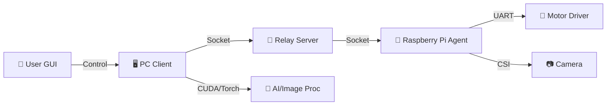

# 🎯 PTCamera_waveshare: Optical WPT 자동 타겟팅 시스템

**Waveshare Pan-Tilt 카메라 모듈을 활용한 고정밀 광학 무선 전력 전송(Optical WPT) 타겟팅 솔루션**

이 프로젝트는 컴퓨터 비전과 딥러닝을 결합하여 원거리의 수신부(Receiver)를 자동으로 탐지하고, 2축 Pan-Tilt 메커니즘을 제어하여 레이저를 정밀하게 조준하는 시스템입니다.

---

## 📋 프로젝트 개요

Optical WPT 시스템에서 송신부(Transmitter)가 수신부(Receiver)를 정확하게 지향하는 것은 전송 효율에 결정적입니다. 본 시스템은 다음과 같은 기술을 통합하여 이 문제를 해결합니다.

*   **실시간 객체 탐지**: YOLOv11 기반의 딥러닝 모델을 사용하여 타겟을 식별합니다.
*   **차분 영상(Difference Imaging)**: LED ON/OFF 이미지를 차분하여 주변광 노이즈를 제거하고 반사판(Retro-reflector) 신호를 극대화합니다.
*   **정밀 제어(Pointing)**: 레이저 피드백 루프를 통해 픽셀 단위의 정밀한 조준을 수행합니다.
*   **왜곡 보정(Undistortion)**: 광각 렌즈의 왜곡을 실시간으로 보정하여 좌표 계산의 정확도를 높입니다.

---

## ⚙️ 시스템 아키텍처

시스템은 **PC(제어/연산)**, **Server(중계)**, **Raspberry Pi(에이전트)**의 3계층 구조로 구성되어 유연한 확장성을 가집니다.

---

## 📂 상세 코드 분석 (Codebase Analysis)

프로젝트의 핵심 로직이 담긴 각 파이썬 파일에 대한 상세 설명입니다.

### 1. 🖥️ PC Client (`Com/`)
사용자가 조작하는 GUI 프로그램이며, 시스템의 두뇌 역할을 합니다.

*   **`test.py` (Main Entry)**
    *   프로그램의 시작점입니다. `App` 클래스를 인스턴스화하고 메인 루프를 실행합니다.
    *   전체적인 초기화 과정과 모듈 간의 연결을 담당합니다.

*   **`app_ui.py` (GUI Layout)**
    *   `tkinter`를 사용하여 윈도우, 탭, 버튼, 라벨 등 모든 UI 요소를 배치하고 구성합니다.
    *   사용자 인터페이스의 디자인과 레이아웃 로직이 분리되어 있습니다.

*   **`event_handlers.py` (Event Processing)**
    *   서버나 다른 스레드로부터 수신된 비동기 이벤트(이미지 수신, 스캔 진행률, 에러 메시지 등)를 처리합니다.
    *   수신된 이미지를 프리뷰 화면에 띄우거나, 스냅샷 저장 후 후처리를 트리거하는 역할을 합니다.

*   **`pointing_handler.py` (Pointing Logic)**
    *   **핵심 알고리즘**: 정밀 조준(Pointing) 모드의 제어 로직이 구현되어 있습니다.
    *   레이저 ON/OFF 이미지를 분석하여 레이저 점의 위치를 찾고, 타겟과의 오차를 계산하여 모터를 제어하는 피드백 루프(Closed-loop)를 수행합니다.

*   **`scan_utils.py` (Scan Controller)**
    *   광역 스캔(Scanning) 작업을 관리합니다.
    *   설정된 범위에 따라 Pan/Tilt 격자 좌표를 생성하고, 수신된 이미지에 대해 YOLO 추론을 수행합니다.
    *   탐지된 객체 정보를 CSV 파일로 로깅하는 기능을 담당합니다.

*   **`image_utils.py` (Image Processing)**
    *   이미지 로드, 저장 및 변환을 담당하는 유틸리티 클래스입니다.
    *   **핵심 기능**: `calib.npz` 데이터를 로드하여 광각 렌즈의 왜곡을 보정(Undistortion)합니다. PyTorch/CUDA 가속을 지원하여 실시간 처리가 가능합니다.

*   **`yolo_utils.py` (AI Wrapper)**
    *   `ultralytics` 라이브러리를 래핑하여 YOLO 모델을 쉽게 사용할 수 있게 합니다.
    *   큰 이미지에서 작은 타겟을 놓치지 않기 위해 이미지를 분할하여 추론하는 **Tiling** 기법이 구현되어 있습니다.

*   **`network.py` (Network Client)**
    *   서버와 통신하기 위한 소켓 클라이언트 클래스(`GuiCtrlClient`, `GuiImgClient`)가 정의되어 있습니다.
    *   제어 명령과 대용량 이미지 데이터를 분리된 채널로 송수신합니다.

*   **`app_helpers.py` (Helper Methods)**
    *   스냅샷 촬영(`snap`), 설정값 계산 등 `App` 클래스에서 사용되는 보조적인 메서드들을 모아둔 파일입니다.

### 2. 🍓 Raspberry Pi Agent (`Raspberrypi/`)
하드웨어를 직접 제어하는 에이전트 프로그램입니다.

*   **`Rasp_main.py` (Hardware Controller)**
    *   **카메라 제어**: `Picamera2`를 사용하여 고속으로 이미지를 캡처하고 스트리밍합니다.
    *   **모터 제어**: 시리얼 포트(UART)를 통해 ESP32 기반의 Pan-Tilt 모터 드라이버에 명령을 전송합니다.
    *   PC로부터 받은 JSON 명령(`scan`, `move`, `snap` 등)을 해석하고 하드웨어를 동작시킵니다.

### 3. 📡 Relay Server (`Server/`)
PC와 라즈베리파이 간의 통신을 중계합니다.

*   **`Server_main.py` (Socket Broker)**
    *   TCP/IP 소켓 서버를 열어 PC와 라즈베리파이의 연결을 수락합니다.
    *   PC에서 보낸 제어 명령을 라즈베리파이로 전달하고, 라즈베리파이에서 보낸 이미지 데이터를 PC로 전달하는 라우팅 역할을 합니다.

---

## 🚀 주요 기능 상세

### 1. 📷 광역 스캔 (Scanning)
*   **Grid Scan**: 설정된 Pan/Tilt 범위(예: -40°~40°)를 자동으로 순회하며 촬영합니다.
*   **Difference Imaging**: 각 위치에서 LED를 켜고 끈 두 장의 이미지를 촬영하여 차분 영상을 생성, 조명 변화에 강인한 탐지를 수행합니다.
*   **Auto Logging**: 탐지된 객체의 좌표와 이미지를 CSV 및 파일로 자동 저장합니다.

### 2. 🎯 정밀 조준 (Pointing)
*   **Click-to-Point**: 스캔 결과(CSV)에서 타겟을 선택하거나 수동으로 좌표를 입력하여 조준을 시작합니다.
*   **Laser Feedback**: 레이저를 켜고 끄며 위치를 인식, 타겟과의 오차를 계산하여 실시간으로 보정합니다(Closed-loop Control).
*   **Sub-pixel Accuracy**: 무게중심(Centroid) 알고리즘을 통해 픽셀 단위 이하의 정밀도를 달성합니다.

### 3. 🖼️ 이미지 처리 (Image Processing)
*   **Real-time Undistortion**: `calib.npz` 데이터를 로드하여 광각 렌즈의 휘어짐을 실시간으로 폅니다.
*   **Snap & Save**: 현재 화면을 캡처하며, 원본과 왜곡 보정본(.ud.jpg)을 동시에 저장할 수 있습니다.

---

## 📝 라이선스 및 참고사항
*   이 프로젝트는 교육 및 연구 목적으로 개발되었습니다.
*   `calib.npz` 파일이 없으면 왜곡 보정 기능이 비활성화됩니다.
*   `yolov11m_diff.pt` 모델 파일이 필요합니다.