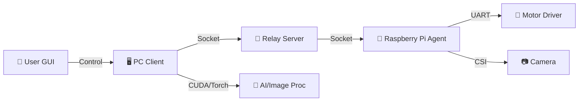
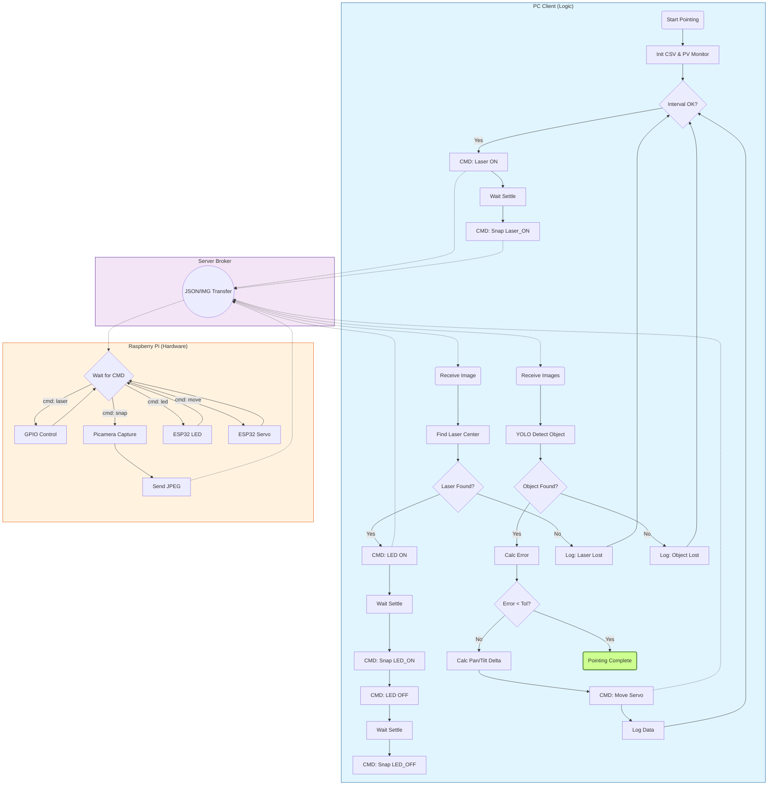

# 🎯 PTCamera_waveshare: Optical WPT 자동 타겟팅 시스템

**Waveshare Pan-Tilt 카메라 모듈을 활용한 고정밀 광학 무선 전력 전송(Optical WPT) 타겟팅 솔루션**

이 프로젝트는 컴퓨터 비전과 딥러닝을 결합하여 원거리의 수신부(Receiver)를 자동으로 탐지하고, 2축 Pan-Tilt 메커니즘을 제어하여 레이저를 정밀하게 조준하는 시스템입니다.

## 🎥 데모 영상 (Demo Video)

<video src="example.mp4" controls="controls" style="max-width: 100%;"></video>
<br>
example.mp4

---

## 📋 프로젝트 개요

Optical WPT 시스템에서 송신부(Transmitter)가 수신부(Receiver)를 정확하게 지향하는 것은 전송 효율에 결정적입니다. 본 시스템은 다음과 같은 기술을 통합하여 이 문제를 해결합니다.

*   **실시간 객체 탐지**: YOLOv11 기반의 딥러닝 모델을 사용하여 타겟을 식별합니다.
*   **차분 영상(Difference Imaging)**: LED ON/OFF 이미지를 차분하여 주변광 노이즈를 제거하고 반사판(Retro-reflector) 신호를 극대화합니다.
*   **Multi-Object Tracking (MOT)**: 코사인 유사도(Cosine Similarity) 기반으로 스캔 중 탐지된 객체를 추적하여, 마지막 위치에서 가까운 객체부터 우선 조준합니다.
*   **정밀 제어(Pointing)**: 레이저 피드백 루프를 통해 픽셀 단위의 정밀한 조준을 수행합니다.
*   **왜곡 보정(Undistortion)**: 광각 렌즈의 왜곡을 실시간으로 보정하여 좌표 계산의 정확도를 높입니다.
*   **배터리 상태 시각화**: 수신부 아두이노가 배터리 전압을 모니터링하고 LED로 충전 상태를 표시합니다.

---

## ⚙️ 시스템 아키텍처

시스템은 **PC(제어/연산)**, **Server(중계)**, **Raspberry Pi(에이전트)**의 3계층 구조로 구성되어 유연한 확장성을 가집니다.



# Pan-Tilt Tracking System Logic



---

## 🧠 핵심 알고리즘 상세 분석 (Core Algorithms)

이 프로젝트의 핵심 기술은 **스캔(Scanning)**과 **정밀 조준(Pointing)** 두 단계로 나뉩니다.

### 1. 📷 Scanning Algorithm (광역 탐색)

전체 작업 공간을 격자(Grid) 형태로 스캔하여 타겟 후보군을 탐색하고 위치 데이터를 수집합니다.

1.  **Grid Traversal**: 설정된 Pan/Tilt 범위(예: -40°~40°)를 일정 간격으로 순회합니다.
2.  **Difference Imaging (차분 영상)**:
    *   각 위치에서 **LED ON** 이미지와 **LED OFF** 이미지를 연속 촬영합니다.
    *   `Diff = |Image_ON - Image_OFF|` 연산을 통해 주변광을 제거하고 반사판(Retro-reflector)의 특징을 극대화합니다.
3.  **Undistortion (왜곡 보정)**:
    *   사전에 계산된 `calib.npz` (Camera Matrix **K**, Distortion Coeffs **D**)를 사용하여 광각 렌즈의 왜곡을 보정합니다.
    *   실시간 처리를 위해 CUDA/Torch 가속을 지원합니다.
4.  **Hybrid YOLO Detection**:
    *   **Tiling**: 고해상도 이미지를 2x3 그리드로 분할하여 작은 객체 탐지율을 높입니다.
    *   **Full Inference**: 전체 이미지에 대해서도 추론하여 큰 객체나 잘린 객체를 보완합니다.
    *   **NMS (Non-Max Suppression)**: 분할 및 전체 추론 결과를 병합하여 중복된 박스를 제거합니다.
5.  **Data Logging**: 탐지된 객체의 Pan/Tilt 각도와 BBox 정보를 CSV로 저장합니다.

### 2. 🎯 Pointing Algorithm (정밀 조준)

수집된 데이터를 바탕으로 타겟의 중심을 추정하고, 레이저 피드백 제어를 통해 오차를 최소화합니다.

#### Phase 1: Coarse Alignment (선형 회귀 추정)
스캔 데이터(CSV)를 분석하여 타겟이 이미지 중심(Optical Axis)에 오게 될 Pan/Tilt 각도를 예측합니다.
*   **Linear Regression**:
    *   `Pixel_X ≈ a * Pan + b`
    *   `Pixel_Y ≈ c * Tilt + d`
*   위 회귀식을 역산하여 `Pixel_X = Width/2`, `Pixel_Y = Height/2`가 되는 `(Pan_Target, Tilt_Target)`을 계산하고 고속 이동합니다.

#### Phase 2: Laser Servoing (Closed-loop Control)
이동 후, 실제 레이저 위치와 타겟 위치의 오차를 실시간으로 보정합니다.
1.  **Laser Detection**:
    *   레이저를 깜빡이며(ON/OFF) 차분 영상을 획득합니다.
    *   **Thresholding**: 차분 영상에 임계값(Threshold=70)을 적용하여 노이즈를 제거한 후, 가중 무게중심(Weighted Centroid)을 계산하여 서브픽셀 단위의 정확도를 확보합니다.
2.  **Target Detection**:
    *   동일한 시점의 영상에서 YOLO를 통해 타겟의 중심 좌표 $(T_x, T_y)$를 획득합니다.
3.  **Adaptive Feedback Control**:
    *   **Data-Driven Gain**: 스캔 단계에서 수집된 데이터(`px/degree` 기울기)를 역산(Inverse Calculation)하여, 모터 제어에 필요한 최적의 `deg/px` 게인값을 동적으로 산출합니다.
    *   **Fine Adjustment**: 오차가 10px 이하로 줄어들면 이동량을 최대 1.0도로 제한하는 미세 조정 모드가 활성화되어 오버슈트를 방지합니다.
    *   **Fallback Strategy**: 레이저가 감지되지 않을 경우, 자동으로 Tilt를 1°씩 내리며(Scanning Down) 레이저를 재탐색하는 복구 로직이 포함되어 있습니다.
    *   비례 제어(P-Control)를 통해 산출된 보정량으로 오차를 0에 수렴시킵니다.

### 1. 🖥️ PC Client (`Com/` - 최신 버전)
사용자가 조작하는 GUI 프로그램이며, 시스템의 두뇌 역할을 합니다.

> [!IMPORTANT]
> **디렉토리 구조 안내**  
> - **`Com/`**: 현재 사용 중인 최신 안정 버전입니다.
> - **`Com_test/`**: MOT (Multi-Object Tracking) 통합 완료 버전입니다.
>   - ✅ track_id 기반 다중 객체 자동 추적
>   - ✅ 객체별 독립 Pointing 계산
>   - ✅ 동적 UI 버튼 생성 (각 객체별 "Move to Target")
> - **`Com_1on1_arduino_valtage/`**: 이전 버전(1:1 방식, 아두이노 INA219 전압 읽기 포함). 참고용으로 보관 중입니다.

*   **`Com_main.py` (Main Entry)**
    *   프로그램의 시작점입니다. `App` 클래스를 인스턴스화하고 메인 루프를 실행합니다.
    *   전체적인 초기화 과정과 모듈 간의 연결을 담당합니다.
    *   **`test.py`**: `Com_main.py`와 동일한 기능을 수행하는 개발/테스트용 실행 파일입니다. 현재 주로 사용되는 진입점입니다.

*   **`app_ui.py` (GUI Layout)**
    *   `tkinter`를 사용하여 윈도우, 탭, 버튼, 라벨 등 모든 UI 요소를 배치하고 구성합니다.
    *   사용자 인터페이스의 디자인과 레이아웃 로직이 분리되어 있습니다.

*   **`event_handlers.py` (Event Processing & Anti-Freeze)**
    *   서버나 다른 스레드로부터 수신된 비동기 이벤트(이미지 수신, 스캔 진행률)를 처리합니다.
    *   **Anti-Freeze Logic**: 네트워크 데이터 폭주 시 UI가 멈추지 않도록 이벤트 처리 루프에 제한(Throttling)을 두어 안정성을 확보했습니다.

*   **`pointing_handler.py` (Pointing Logic)**
    *   **핵심 알고리즘**: 정밀 조준(Pointing) 모드의 제어 로직이 구현되어 있습니다.
    *   레이저 ON/OFF 이미지를 분석하여 레이저 점의 위치를 찾고, 타겟과의 오차를 계산하여 모터를 제어하는 피드백 루프(Closed-loop)를 수행합니다.

*   **`scan_utils.py` (Scan Controller)**
    *   광역 스캔(Scanning) 작업을 관리합니다.
    *   설정된 범위에 따라 Pan/Tilt 격자 좌표를 생성하고, 수신된 이미지에 대해 YOLO 추론을 수행합니다.
    *   탐지된 객체 정보를 CSV 파일로 로깅하는 기능을 담당합니다.
    *   **MOT 통합** (`Com_test/`): ObjectTracker를 사용하여 스캔 중 각 검출에 track_id를 자동 부여합니다.

*   **`MOT.py` (Multi-Object Tracker)** - `Com_test/` 전용
    *   **특징 추출**: 11x11 격자 기반 HSV + Grayscale 히스토그램 (5,808차원)
    *   **추적 알고리즘**: 2단계 글로벌 매칭 (직전 프레임 + 건너뛰기 프레임)
    *   **코사인 유사도**: 특징 벡터 간 유사도로 동일 객체 식별
    *   **파라미터화**: ROI 크기 및 grid_size 설정 가능

*   **`image_utils.py` (Image Processing)**
    *   이미지 로드, 저장 및 변환을 담당하는 유틸리티 클래스입니다.
    *   **핵심 기능**: `calib.npz` 데이터를 로드하여 광각 렌즈의 왜곡을 보정(Undistortion)합니다. PyTorch/CUDA 가속을 지원하여 실시간 처리가 가능합니다.

*   **`yolo_utils.py` (AI Wrapper)**
    *   `ultralytics` 라이브러리를 래핑하여 YOLO 모델을 쉽게 사용할 수 있게 합니다.
    *   큰 이미지에서 작은 타겟을 놓치지 않기 위해 이미지를 분할하여 추론하는 **Tiling** 기법이 구현되어 있습니다.
    *   **IoMin 기반 NMS (Non-Maximum Suppression)**: 표준 IoU 기반 NMS에 더해, IoMin(Intersection over Minimum Area) 방식을 추가로 적용하여 중첩된 박스를 효과적으로 제거합니다.
        - **문제**: 작은 박스가 큰 박스 안에 완전히 포함될 경우, 표준 IoU 값이 매우 낮아(예: 9%) NMS로 걸러지지 않습니다.
        - **해결**: `IoMin = Intersection / Min(Area1, Area2)` 계산을 통해, 작은 박스가 큰 박스에 50% 이상 포함되면 제거합니다.
        - **구현**: 2단계 NMS (1단계: IoU threshold=0.3, 2단계: IoMin threshold=0.5)

*   **`network.py` (Network Client)**
    *   서버와 통신하기 위한 소켓 클라이언트 클래스(`GuiCtrlClient`, `GuiImgClient`)가 정의되어 있습니다.
    *   **Auto Reconnect**: 네트워크 연결이 끊겨도 자동으로 재연결을 시도하여 시스템 가동 시간을 극대화합니다.

*   **`app_helpers.py` (Helper Methods)**
    *   스냅샷 촬영(`snap`), 설정값 계산 등 `App` 클래스에서 사용되는 보조적인 메서드들을 모아둔 파일입니다.


### 2. 🍓 Raspberry Pi Agent (`Raspberrypi/`)
하드웨어를 직접 제어하는 에이전트 프로그램입니다.

*   **`Rasp_main.py` (Hardware Controller)**
    *   **카메라 제어**: `Picamera2`를 사용하여 고속으로 이미지를 캡처하고 스트리밍합니다.
    *   **모터 제어**: 시리얼 포트(UART)를 통해 ESP32 기반의 Pan-Tilt 모터 드라이버에 명령을 전송합니다.
    *   PC로부터 받은 JSON 명령(`scan`, `move`, `snap` 등)을 해석하고 하드웨어를 동작시킵니다.

### 3. 📡 Relay Server (`Server/`)
PC와 라즈베리파이 간의 통신을 중계합니다.

*   **`Server_main.py` (Socket Broker)**
    *   TCP/IP 소켓 서버를 열어 PC와 라즈베리파이의 연결을 수락합니다.
    *   **Non-blocking**: 클라이언트의 비정상 종료 시에도 서버가 멈추지 않도록 타임아웃 및 예외 처리 로직이 강화되었습니다.


### 4. 🔌 수신부 (RX, Receiver)
수신부 하드웨어 설계 및 배터리 모니터링 시스템입니다.

#### 📁 `RX/Arduino/` - 아두이노 펌웨어

*   **`Nano_LED/Nano_LED.ino` (Main - Battery Monitor & LED Indicator)**
    *   **전압 모니터링**: A0 핀으로 배터리 전압을 측정합니다 (10회 평균으로 노이즈 제거).
    *   **RGB LED 상태 표시**:
        - 🔴 **빨간색** (`<3.7V`): 배터리 부족 - 충전 필요
        - 🟢 **녹색** (`3.7V~4.0V`): 정상 배터리 상태
        - 🔵 **파란색** (`≥4.0V`): 충전 완료 또는 충전 중
    *   **시리얼 출력**: 디버깅 및 보정을 위해 전압값을 Serial Monitor로 출력합니다.

*   **`INA219/INA219.ino` (레거시 - INA219 전압센서)**
    *   INA219 센서를 사용한 고정밀 전압 측정 코드 (참고용).

*   **`Mini_LED/Mini_LED.ino` (간이 버전)**
    *   단순화된 LED 표시 코드 (테스트 및 디버깅용).

#### 🖨️ 3D 모델 파일

*   **`Target.stl`**: 수신부 타겟 3D 모델 (STL 형식)
*   **`Target.3mf`**: 3D 프린팅용 프로젝트 파일
*   **`Target.gcode.3mf`**: G-code가 포함된 프린트 준비 파일

---

## 📂 디렉토리 구조 (Directory Structure)

```
PTCamera_waveshare/
├── Com/                     # 최신 안정 버전 (현재 사용)
│   ├── app_ui.py           # GUI 레이아웃
│   ├── event_handlers.py   # 이벤트 처리 및 Anti-Freeze
│   ├── pointing_handler.py # Pointing 알고리즘
│   ├── scan_utils.py       # Scan 알고리즘 및 MOT
│   ├── image_utils.py      # 이미지 처리 및 Undistortion
│   ├── yolo_utils.py       # YOLO 래핑
│   ├── network.py          # 네트워크 클라이언트
│   ├── app_helpers.py      # 보조 메서드
│   ├── Com_main.py         # 메인 진입점
│   └── test.py             # 개발/테스트 진입점 (주로 사용)
│
├── Com_test/               # MOT 통합 버전
│   ├── MOT.py             # ✨ Multi-Object Tracker (NEW)
│   ├── scan_utils.py      # Scan + MOT 통합 (track_id 자동 부여)
│   ├── pointing_handler.py # track_id별 계산 + move_to_target()
│   ├── app_ui.py          # 동적 버튼 생성
│   └── (기타 Com과 동일)
│
├── Com_1on1_arduino_valtage/  # 이전 버전 (참고용)
│   ├── pv_vi.py            # 아두이노 전압 읽기 모듈
│   └── (1:1 방식 레거시 코드)
│
├── Raspberrypi/            # 라즈베리파이 에이전트
│   └── Rasp_main.py        # 하드웨어 제어
│
├── Server/                 # 중계 서버
│   └── Server_main.py      # 소켓 브로커
│
├── RX/                     # 🔌 수신부 (Receiver)
│   ├── Arduino/            # 아두이노 펌웨어
│   │   ├── Nano_LED/       # ✨ 메인 - 배터리 모니터 및 RGB LED
│   │   │   └── Nano_LED.ino
│   │   ├── INA219/         # (레거시) INA219 전압센서 코드
│   │   │   └── INA219.ino
│   │   └── Mini_LED/       # 간이 버전 (테스트용)
│   │       └── Mini_LED.ino
│   ├── Target.stl          # 3D 모델 - STL 형식
│   ├── Target.3mf          # 3D 프린팅 프로젝트 파일
│   └── Target.gcode.3mf    # G-code 포함 프린트 파일
│
├── Experiments/            # 실험 및 테스트 스크립트
│   ├── yolo_utils.py       # YOLO 래핑 (IoMin NMS 포함)
│   │
│   ├── # MOT (Multi-Object Tracking) 테스트
│   ├── mot_scan_hsv.py     # ✅ 최종 검증 완료 - HSV+Grayscale 기반 MOT
│   │                       # - Skip-frame (n-2) 후보 검색
│   │                       # - 양방향 대각선 검색 (지그재그 스캔 대응)
│   │                       # - 2단계 매칭 (threshold 0.3 / 0.35)
│   ├── mot_scan_test.py    # Grayscale 히스토그램 기반 MOT 테스트
│   ├── mot_gray_test.py    # Grayscale 단독 특징 추출 테스트
│   ├── mot_cosin_test.py   # 코사인 유사도 기반 MOT 초기 테스트
│   │
│   ├── # YOLO 추론 테스트
│   ├── SAHI_yolo_test.py   # Tiling 전략 검증 및 IoMin NMS 테스트
│   ├── yolo_test.py        # YOLO 기본 추론 테스트
│   ├── sahi_tiling_visualizer.py  # 타일링 시각화 도구
│   │
│   ├── # Diff 이미지 필터링 실험
│   ├── diff_filter_hsv.py  # HSV 색공간 필터링
│   ├── diff_filter_rgb.py  # RGB 색공간 필터링
│   ├── diff_filter_red.py  # 빨간색 채널 강조
│   ├── diff_filter_yellow.py  # 노란색 채널 강조
│   ├── diff_filter_red_yellow.py  # 빨강+노랑 복합
│   ├── diff_filter_1_2.py  # 비율 필터링 (1:2)
│   │
│   ├── # 레이저 및 LED 감지 실험
│   ├── diff_laser.py       # Diff 기반 레이저 중심 감지
│   ├── diff_laser_hsv.py   # HSV + Diff 레이저 감지
│   ├── led_filter_test.py  # 🔵 대화형 LED 필터 테스트 도구
│   │                       # - 파일 다이얼로그로 이미지 선택
│   │                       # - 클릭으로 100x100 ROI 설정
│   │                       # - 트랙바로 HSV 파라미터 실시간 조절
│   │                       # - 파란색 LED 검출 및 중심 좌표 계산
│   ├── Laser_GPIO.py       # 라즈베리파이 레이저 GPIO 제어
│   │
│   ├── # 유틸리티
│   ├── generate_diff_dataset.py  # Diff 학습 데이터셋 생성
│   ├── view_diff.py        # Diff 이미지 시각화
│   ├── rate_image.py       # 이미지 품질 평가
│   └── undistort_gui.py    # 왜곡 보정 GUI 도구
│
├── Docs/                   # 문서
├── calib.npz               # 카메라 보정 파일
├── yolov11n_diff.pt        # YOLOv11 Nano 모델
├── yolov11m_diff.pt        # YOLOv11 Medium 모델
└── example.mp4             # 데모 영상
```

---

## 🚀 Future Works (진행 중인 개선 사항)

> [!NOTE]
> 다음 항목들은 `Com_test/` 폴더에서 개발 및 테스트 중이며, 검증 완료 후 `Com/`으로 병합될 예정입니다.

### 1. ✅ ~~Multi-Object Tracking 통합~~ **(완료)**

**목표**: 스캔 중 여러 객체를 자동 추적하고 각 객체별 타겟 위치 계산.

**완료 항목** (`Com_test/`):
- [x] **MOT.py 모듈 생성**: HSV+Grayscale 히스토그램 기반 ObjectTracker
    - ✅ 11x11 격자 기반 특징 추출 (5,808차원)
    - ✅ 2단계 글로벌 매칭 (직전 + 건너뛰기 프레임)
    - ✅ 코사인 유사도 기반 객체 식별
- [x] **scan_utils.py 통합**: 스캔 시 track_id 자동 부여
- [x] **pointing_handler.py 수정**: track_id별 독립 계산 + move_to_target() 메서드
- [x] **동적 UI 생성**: 각 객체별 "Move to Target" 버튼
- [x] **CSV 형식 업데이트**: track_id 컬럼 추가
- [x] **아두이노 코드 제거**: PV Monitor 제거 (Com_1on1_arduino_valtage로 이동)

**다음 단계**:
- [ ] **자동 스캔 → Pointing 워크플로우**: GUI 실행 시 자동 스캔 및 순차 조준
- [ ] **Com/ 병합**: 실제 RX 패널 제작 후 검증 완료 시 안정 버전으로 통합

### 2. ✅ ~~YOLOv11n Nested Object Detection 개선~~ **(완료)**
**문제**: 작은 객체가 큰 객체 내부에서 중복 탐지되는 현상 발생.

**해결 완료**:
- [x] **IoMin 기반 NMS 구현** (Option 2 선택):
    - 표준 IoU 기반 NMS에 더해 IoMin(Intersection over Minimum Area) 방식 추가
    - `IoMin = Intersection / Min(Area1, Area2)` 계산
    - 2단계 NMS: IoU threshold 0.3 → IoMin threshold 0.5
    - 작은 박스가 큰 박스에 50% 이상 포함 시 자동 제거

**구현 위치**: `Com/yolo_utils.py` 및 `Experiments/yolo_utils.py`의 `improved_nms()` 함수

### 3. 🔋 배터리 인식 상태 확인
**목표**: 수신부 배터리 상태를 원격에서도 확인할 수 있도록 개선.

**개선 방안**:
- [ ] **시각적 피드백 강화**: 카메라로 RGB LED를 감지하여 GUI에 배터리 상태 표시
- [ ] **통신 기반 모니터링**: 수신부 아두이노에서 무선 통신으로 전압 데이터 전송 (선택사항)

**현재 상태**: 기본 LED 표시 기능 완료 (`Nano_LED.ino`).

### 4. ✅ ~~하드웨어 파라미터 튜닝~~ **(완료)**
**목표**: 다양한 환경에서 최적의 성능을 위한 파라미터 최적화.

**완료 항목**:
- [x] LED settle time 최적화
- [x] Laser threshold 개선
- [x] Scan grid resolution 조정
- [x] Pointing feedback gain 미세 조정


---

## 📝 라이선스 및 참고사항
*   이 프로젝트는 교육 및 연구 목적으로 개발되었습니다.
*   `calib.npz` 파일이 없으면 왜곡 보정 기능이 비활성화됩니다.
*   `yolov11n_diff.pt` 또는 `yolov11m_diff.pt` 모델 파일이 필요합니다.
