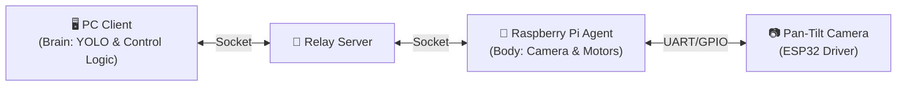

# 🎯 PTCamera_waveshare: Optical WPT Targeting System

**Waveshare Pan-Tilt 카메라 모듈을 활용한 광학 무선 전력 전송(Optical WPT) 자동 타겟팅 시스템**

[](https://www.python.org/)
[](https://opencv.org/)
[](https://github.com/ultralytics/ultralytics)

---

## 📋 프로젝트 개요

이 프로젝트는 **Optical Wireless Power Transfer (OWPT)** 시스템을 위한 고정밀 자동 타겟팅 솔루션입니다.  
컴퓨터 비전(OpenCV)과 딥러닝(YOLOv11)을 결합하여 수신부(Receiver)를 실시간으로 탐지하고, 2축 Pan-Tilt 메커니즘을 제어하여 레이저를 정확하게 조준합니다.

### 🌟 핵심 목표
- **자동화 (Automation)**: 광역 스캔부터 정밀 조준까지 원클릭 실행
- **정확성 (Precision)**: 렌즈 왜곡 보정 및 Closed-loop 피드백 제어
- **강건성 (Robustness)**: 조명 변화에 강한 차분 영상(Difference Image) 기법 적용

---

## ⚙️ 시스템 아키텍처

시스템은 **PC(제어 및 연산)**, **Raspberry Pi(카메라 및 모터 제어)**, **Server(통신 중계)**의 3계층 구조로 이루어져 있습니다.



---

## 📂 디렉토리 구조

```
PTCamera_waveshare/
├── 📁 Com/                  # 🖥️ PC Client (핵심 로직)
│   ├── Com_main.py          # 메인 GUI 및 제어 프로그램
│   └── ...
├── 📁 Raspberrypi/          # 🍓 Raspberry Pi Agent
│   ├── Rasp_main.py         # 하드웨어 제어 및 이미지 스트리밍
│   └── ...
├── 📁 Server/               # 📡 Relay Server
│   ├── Server_main.py       # 소켓 중계 서버
│   └── ...
├── 📁 Experiments/          # 🧪 실험 및 유틸리티
│   ├── undistort_gui.py     # 캘리브레이션 테스트 도구
│   └── ...
├── 📄 calib.npz             # 카메라 렌즈 캘리브레이션 데이터
├── 📄 yolov11m_diff.pt      # YOLOv11 학습 모델 (Difference Image 전용)
└── 📄 README.md             # 프로젝트 문서
```

---

## 🧠 핵심 알고리즘 상세 분석

이 프로젝트의 핵심 기술은 **스캔(Scanning)**과 **정밀 조준(Pointing)** 두 단계로 나뉩니다.

### 1. 📷 Scanning Algorithm (광역 탐색)

전체 작업 공간을 격자(Grid) 형태로 스캔하여 타겟 후보군을 탐색하고 위치 데이터를 수집합니다.

1.  **Grid Traversal**: 설정된 Pan/Tilt 범위(예: -40°~40°)를 일정 간격으로 순회합니다.
2.  **Difference Imaging (차분 영상)**:
    *   각 위치에서 **LED ON** 이미지와 **LED OFF** 이미지를 연속 촬영합니다.
    *   `Diff = |Image_ON - Image_OFF|` 연산을 통해 주변광을 제거하고 반사판(Retro-reflector)의 특징을 극대화합니다.
3.  **Undistortion (왜곡 보정)**:
    *   사전에 계산된 `calib.npz` (Camera Matrix **K**, Distortion Coeffs **D**)를 사용하여 광각 렌즈의 왜곡을 보정합니다.
    *   실시간 처리를 위해 CUDA/Torch 가속을 지원합니다.
4.  **Hybrid YOLO Detection**:
    *   **Tiling**: 고해상도 이미지를 2x3 그리드로 분할하여 작은 객체 탐지율을 높입니다.
    *   **Full Inference**: 전체 이미지에 대해서도 추론하여 큰 객체나 잘린 객체를 보완합니다.
    *   **NMS (Non-Max Suppression)**: 분할 및 전체 추론 결과를 병합하여 중복된 박스를 제거합니다.
5.  **Data Logging**: 탐지된 객체의 Pan/Tilt 각도와 BBox 정보를 CSV로 저장합니다.

### 2. 🎯 Pointing Algorithm (정밀 조준)

수집된 데이터를 바탕으로 타겟의 중심을 추정하고, 레이저 피드백 제어를 통해 오차를 최소화합니다.

#### Phase 1: Coarse Alignment (선형 회귀 추정)
스캔 데이터(CSV)를 분석하여 타겟이 이미지 중심(Optical Axis)에 오게 될 Pan/Tilt 각도를 예측합니다.
*   **Linear Regression**:
    *   `Pixel_X ≈ a * Pan + b`
    *   `Pixel_Y ≈ c * Tilt + d`
*   위 회귀식을 역산하여 `Pixel_X = Width/2`, `Pixel_Y = Height/2`가 되는 `(Pan_Target, Tilt_Target)`을 계산하고 고속 이동합니다.

#### Phase 2: Laser Servoing (Closed-loop Control)
이동 후, 실제 레이저 위치와 타겟 위치의 오차를 실시간으로 보정합니다.
1.  **Laser Detection**:
    *   레이저를 깜빡이며(ON/OFF) 차분 영상을 획득합니다.
    *   **Weighted Centroid**: 차분 영상의 밝기 모멘트(Moments)를 계산하여 레이저의 중심 좌표 $(L_x, L_y)$를 서브픽셀 단위로 검출합니다.
2.  **Target Detection**:
    *   동일한 시점의 영상에서 YOLO를 통해 타겟의 중심 좌표 $(T_x, T_y)$를 획득합니다.
3.  **Feedback Control**:
    *   오차 벡터 $(\Delta x, \Delta y) = (T_x - L_x, T_y - L_y)$를 계산합니다.
    *   비례 제어(P-Control)를 통해 Pan/Tilt 보정량을 산출하여 모터를 미세 조정합니다.
    *   오차가 허용 범위(Tolerance) 이내로 들어올 때까지 반복합니다.

---

## 🚀 설치 및 실행 가이드

### 1. 필수 요구 사항
*   **PC**: Python 3.8+, NVIDIA GPU (권장), CUDA Toolkit
*   **Raspberry Pi**: Python 3.8+, Picamera2, RPi.GPIO

### 2. 라이브러리 설치
```bash
# PC
pip install opencv-python numpy ultralytics torch torchvision

# Raspberry Pi
sudo apt install python3-picamera2
pip install pyserial
```

### 3. 실행 순서
시스템은 반드시 다음 순서대로 실행해야 합니다.

1.  **Relay Server 실행**
    ```bash
    cd Server
    python Server_main.py
    ```
2.  **Raspberry Pi Agent 실행**
    ```bash
    cd Raspberrypi
    python Rasp_main.py
    ```
3.  **PC Client 실행**
    ```bash
    cd Com
    python Com_main.py
    ```

---

## 📄 라이선스
이 프로젝트는 교육 및 연구 목적으로 개발되었습니다.