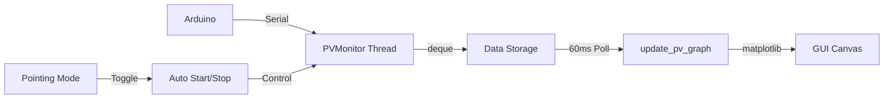

# 🎯 PTCamera_waveshare: Optical WPT 자동 타겟팅 시스템

**Waveshare Pan-Tilt 카메라 모듈을 활용한 고정밀 광학 무선 전력 전송(Optical WPT) 타겟팅 솔루션**

이 프로젝트는 컴퓨터 비전과 딥러닝을 결합하여 원거리의 수신부(Receiver)를 자동으로 탐지하고, 2축 Pan-Tilt 메커니즘을 제어하여 레이저를 정밀하게 조준하는 시스템입니다.

---

## 📋 프로젝트 개요

Optical WPT 시스템에서 송신부(Transmitter)가 수신부(Receiver)를 정확하게 지향하는 것은 전송 효율에 결정적입니다. 본 시스템은 다음과 같은 기술을 통합하여 이 문제를 해결합니다.

*   **실시간 객체 탐지**: YOLOv11 기반의 딥러닝 모델을 사용하여 타겟을 식별합니다.
*   **차분 영상(Difference Imaging)**: LED ON/OFF 이미지를 차분하여 주변광 노이즈를 제거하고 반사판(Retro-reflector) 신호를 극대화합니다.
*   **정밀 제어(Pointing)**: 레이저 피드백 루프를 통해 픽셀 단위의 정밀한 조준을 수행합니다.
*   **왜곡 보정(Undistortion)**: 광각 렌즈의 왜곡을 실시간으로 보정하여 좌표 계산의 정확도를 높입니다.

---

## ⚙️ 시스템 아키텍처

시스템은 **PC(제어/연산)**, **Server(중계)**, **Raspberry Pi(에이전트)**의 3계층 구조로 구성되어 유연한 확장성을 가집니다.

```mermaid
graph LR
    User[👤 User GUI] -->|Control| PC[🖥️ PC Client]
    PC -->|Socket| Server[📡 Relay Server]
    Server -->|Socket| Pi[🍓 Raspberry Pi Agent]
    Pi -->|UART| ESP32[🤖 Motor Driver]
    Pi -->|CSI| Cam[📷 Camera]
    PC -->|CUDA/Torch| GPU[🚀 AI/Image Proc]
```



---

## 🧠 핵심 알고리즘 상세 분석 (Core Algorithms)

이 프로젝트의 핵심 기술은 **스캔(Scanning)**과 **정밀 조준(Pointing)** 두 단계로 나뉩니다.

### 1. 📷 Scanning Algorithm (광역 탐색)

전체 작업 공간을 격자(Grid) 형태로 스캔하여 타겟 후보군을 탐색하고 위치 데이터를 수집합니다.

1.  **Grid Traversal**: 설정된 Pan/Tilt 범위(예: -40°~40°)를 일정 간격으로 순회합니다.
2.  **Difference Imaging (차분 영상)**:
    *   각 위치에서 **LED ON** 이미지와 **LED OFF** 이미지를 연속 촬영합니다.
    *   `Diff = |Image_ON - Image_OFF|` 연산을 통해 주변광을 제거하고 반사판(Retro-reflector)의 특징을 극대화합니다.
3.  **Undistortion (왜곡 보정)**:
    *   사전에 계산된 `calib.npz` (Camera Matrix **K**, Distortion Coeffs **D**)를 사용하여 광각 렌즈의 왜곡을 보정합니다.
    *   실시간 처리를 위해 CUDA/Torch 가속을 지원합니다.
4.  **Hybrid YOLO Detection**:
    *   **Tiling**: 고해상도 이미지를 2x3 그리드로 분할하여 작은 객체 탐지율을 높입니다.
    *   **Full Inference**: 전체 이미지에 대해서도 추론하여 큰 객체나 잘린 객체를 보완합니다.
    *   **NMS (Non-Max Suppression)**: 분할 및 전체 추론 결과를 병합하여 중복된 박스를 제거합니다.
5.  **Data Logging**: 탐지된 객체의 Pan/Tilt 각도와 BBox 정보를 CSV로 저장합니다.

### 2. 🎯 Pointing Algorithm (정밀 조준)

수집된 데이터를 바탕으로 타겟의 중심을 추정하고, 레이저 피드백 제어를 통해 오차를 최소화합니다.

#### Phase 1: Coarse Alignment (선형 회귀 추정)
스캔 데이터(CSV)를 분석하여 타겟이 이미지 중심(Optical Axis)에 오게 될 Pan/Tilt 각도를 예측합니다.
*   **Linear Regression**:
    *   `Pixel_X ≈ a * Pan + b`
    *   `Pixel_Y ≈ c * Tilt + d`
*   위 회귀식을 역산하여 `Pixel_X = Width/2`, `Pixel_Y = Height/2`가 되는 `(Pan_Target, Tilt_Target)`을 계산하고 고속 이동합니다.

#### Phase 2: Laser Servoing (Closed-loop Control)
이동 후, 실제 레이저 위치와 타겟 위치의 오차를 실시간으로 보정합니다.
1.  **Laser Detection**:
    *   레이저를 깜빡이며(ON/OFF) 차분 영상을 획득합니다.
    *   **Weighted Centroid**: 차분 영상의 밝기 모멘트(Moments)를 계산하여 레이저의 중심 좌표 $(L_x, L_y)$를 서브픽셀 단위로 검출합니다.
2.  **Target Detection**:
    *   동일한 시점의 영상에서 YOLO를 통해 타겟의 중심 좌표 $(T_x, T_y)$를 획득합니다.
3.  **Feedback Control**:
    *   오차 벡터 $(\Delta x, \Delta y) = (T_x - L_x, T_y - L_y)$를 계산합니다.
    *   비례 제어(P-Control)를 통해 Pan/Tilt 보정량을 산출하여 모터를 미세 조정합니다.
    *   오차가 허용 범위(Tolerance) 이내로 들어올 때까지 반복합니다.

---

## 📂 상세 코드 분석 (Codebase Analysis)

프로젝트의 핵심 로직이 담긴 각 파이썬 파일에 대한 상세 설명입니다.

### 1. 🖥️ PC Client (`Com/`)
사용자가 조작하는 GUI 프로그램이며, 시스템의 두뇌 역할을 합니다.

*   **`Com_main.py` (Main Entry)**
    *   프로그램의 시작점입니다. `App` 클래스를 인스턴스화하고 메인 루프를 실행합니다.
    *   전체적인 초기화 과정과 모듈 간의 연결을 담당합니다.

*   **`app_ui.py` (GUI Layout)**
    *   `tkinter`를 사용하여 윈도우, 탭, 버튼, 라벨 등 모든 UI 요소를 배치하고 구성합니다.
    *   사용자 인터페이스의 디자인과 레이아웃 로직이 분리되어 있습니다.

*   **`event_handlers.py` (Event Processing)**
    *   서버나 다른 스레드로부터 수신된 비동기 이벤트(이미지 수신, 스캔 진행률, 에러 메시지 등)를 처리합니다.
    *   수신된 이미지를 프리뷰 화면에 띄우거나, 스냅샷 저장 후 후처리를 트리거하는 역할을 합니다.

*   **`pointing_handler.py` (Pointing Logic)**
    *   **핵심 알고리즘**: 정밀 조준(Pointing) 모드의 제어 로직이 구현되어 있습니다.
    *   레이저 ON/OFF 이미지를 분석하여 레이저 점의 위치를 찾고, 타겟과의 오차를 계산하여 모터를 제어하는 피드백 루프(Closed-loop)를 수행합니다.

*   **`scan_utils.py` (Scan Controller)**
    *   광역 스캔(Scanning) 작업을 관리합니다.
    *   설정된 범위에 따라 Pan/Tilt 격자 좌표를 생성하고, 수신된 이미지에 대해 YOLO 추론을 수행합니다.
    *   탐지된 객체 정보를 CSV 파일로 로깅하는 기능을 담당합니다.

*   **`image_utils.py` (Image Processing)**
    *   이미지 로드, 저장 및 변환을 담당하는 유틸리티 클래스입니다.
    *   **핵심 기능**: `calib.npz` 데이터를 로드하여 광각 렌즈의 왜곡을 보정(Undistortion)합니다. PyTorch/CUDA 가속을 지원하여 실시간 처리가 가능합니다.

*   **`yolo_utils.py` (AI Wrapper)**
    *   `ultralytics` 라이브러리를 래핑하여 YOLO 모델을 쉽게 사용할 수 있게 합니다.
    *   큰 이미지에서 작은 타겟을 놓치지 않기 위해 이미지를 분할하여 추론하는 **Tiling** 기법이 구현되어 있습니다.

*   **`network.py` (Network Client)**
    *   서버와 통신하기 위한 소켓 클라이언트 클래스(`GuiCtrlClient`, `GuiImgClient`)가 정의되어 있습니다.
    *   제어 명령과 대용량 이미지 데이터를 분리된 채널로 송수신합니다.

*   **`app_helpers.py` (Helper Methods)**
    *   스냅샷 촬영(`snap`), 설정값 계산 등 `App` 클래스에서 사용되는 보조적인 메서드들을 모아둔 파일입니다.

*   **`pv_vi.py` (PV Monitoring) 🆕**
    *   **실시간 전압/전류 모니터링**: 아두이노에서 Serial 통신으로 전압, 전류, 전력 데이터를 수집합니다.
    *   `PVMonitor` 클래스는 별도 스레드에서 데이터를 수집하며, thread-safe deque를 사용하여 최대 100개의 데이터 포인트를 저장합니다.
    *   Pointing 모드 활성화 시 자동으로 모니터링이 시작되어 광 전력 전송 효율을 실시간으로 추적할 수 있습니다.

### 2. 🍓 Raspberry Pi Agent (`Raspberrypi/`)
하드웨어를 직접 제어하는 에이전트 프로그램입니다.

*   **`Rasp_main.py` (Hardware Controller)**
    *   **카메라 제어**: `Picamera2`를 사용하여 고속으로 이미지를 캡처하고 스트리밍합니다.
    *   **모터 제어**: 시리얼 포트(UART)를 통해 ESP32 기반의 Pan-Tilt 모터 드라이버에 명령을 전송합니다.
    *   PC로부터 받은 JSON 명령(`scan`, `move`, `snap` 등)을 해석하고 하드웨어를 동작시킵니다.

### 3. 📡 Relay Server (`Server/`)
PC와 라즈베리파이 간의 통신을 중계합니다.

*   **`Server_main.py` (Socket Broker)**
    *   TCP/IP 소켓 서버를 열어 PC와 라즈베리파이의 연결을 수락합니다.
    *   PC에서 보낸 제어 명령을 라즈베리파이로 전달하고, 라즈베리파이에서 보낸 이미지 데이터를 PC로 전달하는 라우팅 역할을 합니다.

---

## ☀️ PV Monitoring (실시간 전압/전류 모니터링) 🆕

Pointing 모드 실행 시 수신부의 전압/전류를 실시간으로 모니터링하여 광 전력 전송 효율을 추적하는 기능이 추가되었습니다.

### 주요 기능
*   **실시간 데이터 수집**: 아두이노에서 전압(V), 전류(mA), 전력(mW) 데이터를 Serial 통신으로 수집
*   **자동 시작**: Pointing 모드 활성화 시 자동으로 PV 모니터링 시작
*   **실시간 그래프**: 3개 서브플롯(전압/전류/전력)으로 시간에 따른 데이터 변화 시각화
*   **Thread-safe 구조**: 별도 스레드에서 데이터 수집, 메인 루프와 독립적으로 동작

### 아키텍처


### 사용 방법
1. **아두이노 연결**: 전압/전류 센서가 연결된 아두이노를 COM 포트에 연결
2. **matplotlib 설치** (선택):
   ```bash
   pip install matplotlib
   ```
   *참고: matplotlib이 없어도 다른 기능은 정상 작동하며, PV Monitor 탭에 설치 안내 메시지 표시*

3. **GUI 실행**:
   ```bash
   cd Com
   python test.py  # 또는 Com_main.py (원본)
   ```

4. **PV Monitor 탭**:
   - Pointing 모드 활성화 시 자동으로 모니터링 시작
   - 수동 시작: Port 설정 후 "▶ Start" 버튼
   - "Clear Graph" 버튼으로 히스토리 초기화

### 아두이노 코드 예시
```cpp
// 아두이노가 Serial로 전송하는 데이터 포맷: "voltage,current,power\n"
float voltage = analogRead(A0) * (5.0 / 1023.0);
float current = analogRead(A1) * (100.0 / 1023.0);
float power = voltage * current;
Serial.print(voltage);
Serial.print(",");
Serial.print(current);
Serial.print(",");
Serial.println(power);
delay(100);
```

---

## 📝 라이선스 및 참고사항
*   이 프로젝트는 교육 및 연구 목적으로 개발되었습니다.
*   `calib.npz` 파일이 없으면 왜곡 보정 기능이 비활성화됩니다.
*   `yolov11m_diff.pt` 모델 파일이 필요합니다.
*   **matplotlib 라이브러리**: PV 모니터링 기능 사용 시 필요 (선택 사항)
